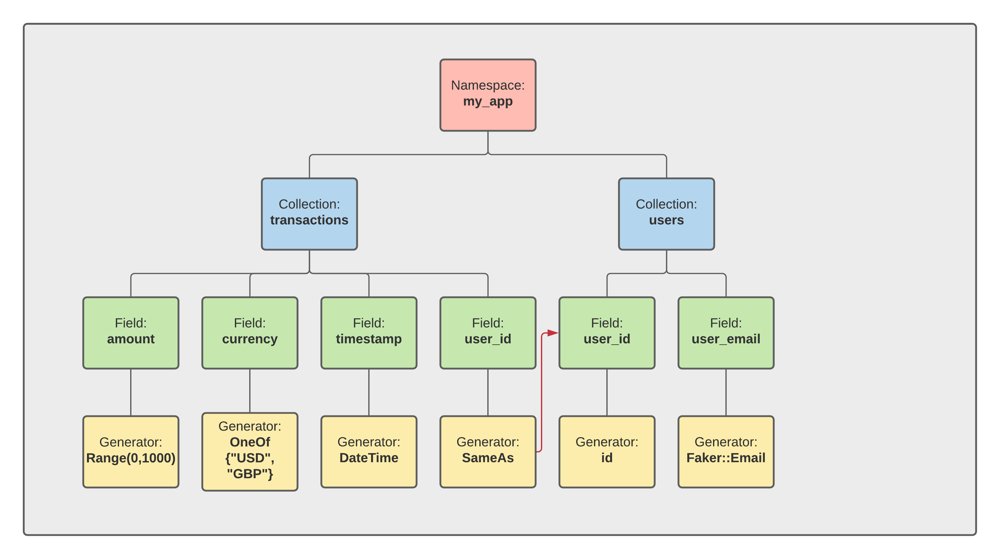
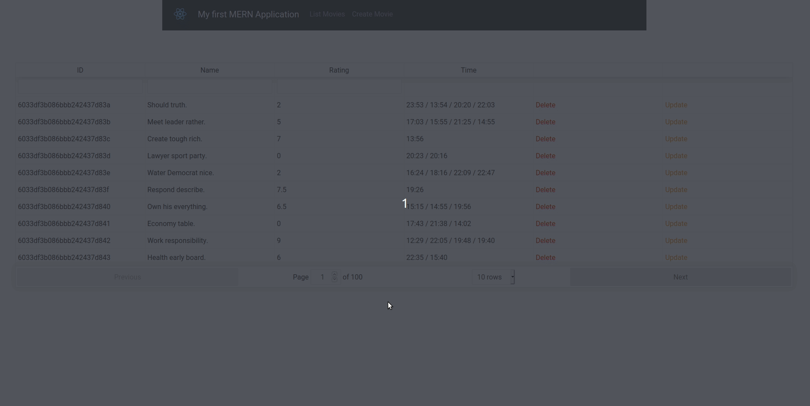

So we've all been in this situation. You're building a Web App, you're super productive in your stack and you can go quickly - however generating lot's of data to see what your app will look like with enough users and traffic is a pain. 

Either you're going to spend a lot of time manually inputting data or you're going to write some scripts to generate that data for you. There *must* be a better way.

In this post we're going to explore how we can solve this problem using the open-source project [Synth][synth]. Synth is a state-of-the-art declarative data generator - you tell Synth what you want your data to look like and Synth will generate that data for you.

This tutorial is going to use a simple MERN (**M**ongo **E**xpress **R**eact **N**ode) web-app as our test subject, but really Synth is not married to any specific stack.

I'm going to assuming you're working on MacOS or Linux (Windows support coming soon 🤞) and you have [NodeJS](https://nodejs.org/en/), [Yarn](https://yarnpkg.com/getting-started/install) and [Docker](https://docs.docker.com/get-docker/) installed.

For this example we'll be running Synth version `0.3.2` .

## Getting started

As a template, we'll use a repository which will give us scaffolding for the MERN app. I picked this example because it shows how to get started quickly with a MERN stack, where the end product is a usable app you can write in 10 minutes. For our purposes, we don't really need to build it from scratch, so let's just clone the repo and avoid writing any code ourselves.

```bash
git clone https://github.com/samaronybarros/movies-app.git && cd movies-app
```

Next, we'll be using docker to run an ephemeral version of our database locally. Docker is great for getting started quickly with popular software, and luckily for us MongoDB has an image on the docker registry. So - let's setup an instance of MongoDB to run locally (no username / password):

```bash
docker run -d --name mongo-on-docker -p 27017:27017 mongo
```

## Starting the Web App

The repository we just cloned contains a working end-to-end web-app running on a MERN stack. It's a super simple CRUD application enabling the user to add / remove some movie reviews which are persisted on a MongoDB database.

The app consists of 2 main components, a `nodejs` server which lives under the `movies-app/server/` sub-directory, and a `React` front-end which lives under the `movies-app/client` sub-directory. 

The client and server talk to each other using a standard HTTP API under `/movie`.

So let's get started and run the back-end:

```bash
cd server && yarn install && node index.js
```

And then the client (you'll need two terminals here 🤷):

```bash
cd client && yarn install && yarn start
```

Cool! If you navigate to [`http://localhost:8000/`](http://localhost:8000/) you should see the React App running 🙂

## Let's add some movies by hand

Hold the phone. Why are we adding movies by hand since we have a tool to generate data for us?

Well, by adding a little bit of test data by hand, we can then use Synth to infer the structure of the data and create as many movies as we want for us. Otherwise we would have to write the entire data definition (what we call a [schema](/docs/getting_started/schema)) by hand.

So, let's add a couple of movies manually using the Web UI.


Ok, so now that we have a couple of movies, let's get started with Synth!

## Synth

In the following section we will cover how Synth fits into the Web App development workflow:

1. First we'll install the Synth binary
2. Then we'll initialize a Synth workspace in our repo to host our data model
3. Next will ingest data from MongoDB into Synth
4. And finally generate a bunch of fake data from Synth and back into Mongo

## Installing Synth

To install Synth on MacOS / Linux, visit the [docs](/) and choose the appropriate installation for your OS. If you are feeling adventurous, you can even build from source!

## Declarative Data Generation

Synth uses a declarative data model to specify how data is generated.

Hmmm, so what is a declarative model you may ask? A **declarative model**, as opposed to an imperative model, is where you 'declare' your desired end state and the underlying program will figure out how to get there. 

On the other had, an imperative model (which is what we are mostly used to), is step by step instructions on how to get to our end-state. Most popular programming languages like Java or C are *imperative* - your code is step-by-step instructions on how to reach an end state.

Programming frameworks like SQL or React or Terraform are declarative. You don't specify how to get to your end-state, you just specify what you want and the underlying program will figure out how to get there.

With Synth you specify what your desired dataset should look like, not how to make it. Synth figures how to build it for you 😉

## Creating a Workspace

A **workspace** represents a set of synthetic data namespaces managed by Synth. Workspaces are marked by `.synth/` sub-directory.

A workspace can have *zero or more namespaces*, where the namespaces are just represented as sub-directories. All information pertaining to a workspace is in its directory.

So let's create sub-directory called `data/` and initialize our Synth workspace.

```bash
movies-app $ mkdir data && cd data && synth init
```

## Namespaces

The **namespace** is the top-level abstraction in Synth. Namespaces are the equivalent of Schemas in SQL-land. Fields in a namespace can refer to other fields in a namespace - but you cannot reference data across namespaces.

Namespaces in turn, have **collections** which are kind of like tables in SQL-land. A visual example of the namespace/collection hierarchy can be seen below.



To create a namespace, we need to feed some data into Synth.

## Feeding Data into Synth

There are two steps to feed data into Synth from our MongoDB instance:

1. We need to export data from MongoDB into a format that Synth can ingest. Luckily for us, Synth supports JSON out of the box so this can be done quite easily with the `mongoexport` command - a light weight tool that ships with MongoDB to enable quick dumps of the database via the CLI. We need to specify a little bit more metadata, such as the database we want to export from using `--db cinema` , the collection using `--collection` and the specific fields we are interested in `--fields name,rating,time`. We want the data from `mongoexport` to be in a JSON array so that Synth can easily parse it, so let's specify the `--jsonArray` flag.
2. Next, we need to create a new Synth namespace using the `synth import` command. `synth import` supports a `--from` flag if you want to import from a file, but if this is not specified it will default to reading from `stdin`. We need to feed the output of the `mongoexport` command into Synth. To do this we can use the convenient Bash pipe `|` to redirect the `stdout` from `mongoexport` into Synth's `stdin`.

```bash
docker exec -i mongo-on-docker mongoexport \
	--db cinema \
	--collection movies \
	--fields name,rating,time \
	--forceTableScan \
	--jsonArray | synth import cinema --collection movies
```

Synth runs an inference step on the JSON data that it's fed, trying to infer the structure of the data. Next Synth automatically creates the `cinema` namespace by creating the `cinema/` sub-directory and populates it with the collection `movies.json`.

```bash
$ tree -a data/
data/
├── .synth
│   └── config.toml
└── cinema
    └── movies.json
```

We can now use this namespace to generate some data:

```bash
$ synth generate cinema/
{
  "movies": [
    {
      "_id": {
        "$oid": "2D4p4WBXpVTMrhRj"
      },
      "name": "2pvj5fas0dB",
      "rating": 7.5,
      "time": [
        "TrplCeFShATp2II422rVdYQB3zVx"
      ]
    },
    {
      "_id": {
        "$oid": "mV57kUhvdsWUwiRj"
      },
      "name": "Ii7rH2TSjuUiyt",
      "rating": 2.5,
      "time": [
        "QRVSMW"
      ]
    }
  ]
}
```

So now we've generated data with the same schema as the original - but the value of the data points doesn't really line up with the semantic meaning  of our dataset. For example, the `time` array is just garbled text, not actual times of the day.

The last steps is to tweak the Synth schema and create some realistic looking data!

## Tweaking the Synth schema

So let's open `cinema/movies.json` in our favorite text editor and take a look at the schema:

```json synth
{
  "type": "array",
  "length": {
    "type": "number",
    "subtype": "u64",
    "range": {
      "low": 1,
      "high": 4,
      "step": 1
    }
  },
  "content": {
    "type": "object",
    "time": {
      "type": "array",
      "length": {
        "type": "number",
        "subtype": "u64",
        "range": {
          "low": 1,
          "high": 2,
          "step": 1
        }
      },
      "content": {
        "type": "one_of",
        "variants": [
          {
            "weight": 1.0,
            "type": "string",
            "pattern": "[a-zA-Z0-9]*"
          }
        ]
      }
    },
    "name": {
      "type": "string",
      "pattern": "[a-zA-Z0-9]*"
    },
    "_id": {
      "type": "object",
      "$oid": {
        "type": "string",
        "pattern": "[a-zA-Z0-9]*"
      }
    },
    "rating": {
      "type": "number",
      "subtype": "f64",
      "range": {
        "low": 7.0,
        "high": 10.0,
        "step": 1.0
      }
    }
  }
}
```

There is a lot going on here but let's break it down. 

The top-level object (which represents our `movies` collection) is of type `array` - where the `content` of the array is an object with 4 fields, `_id`, `name`, `time`, and `rating`. 

We can completely remove the field `_id` since this is automatically managed by MongoDB and get started in making our data look real. You may want to have the [Generators Reference](/docs/content/null) open here for reference.

### Rating

First let's change the `rating` field. Our app can only accept numbers between 0 and 10 inclusive in increments of 0.5. So we'll use the `Number::Range` content type to represent this and replace the existing value:

```json synth
{
    "range": {
        "high": 10,
        "low": 0, 
        "step": 0.5
    },
    "subtype": "f64",
    "type": "number"
}
```

### Time

The `time` field has been correctly detected as an array of values. First of all, let's say a movie can be shown up to 5 times a day, so we'll change the `high` field at `time.length.range` to 6 (`high` is exclusive). At this stage, the values are just random strings, so let's instead use the `String::DateTime` content type to generate hours of the day.

```json synth
{
    "type": "array",
    "length": {
        "type": "number",
        "subtype": "u64",
        "range": {
            "low": 1,
            "high": 5,
            "step": 1
        }
    },
    "content": {
        "type": "one_of",
        "variants": [
            {
                "weight": 1.0,
                "type": "string",
                "date_time": {
                    "subtype": "naive_time",
                    "format": "%H:%M",
                    "begin": "12:00",
                    "end": "23:59"
                }
            }
        ]
    }
}
```

### Name

Finally, the movie name field should be populated with realistic looking movie names.

Under the hood, Synth uses the Python Faker library to generate so called 'semantic types' (think credit card numbers, addresses, license plates etc.). Unfortunately Faker does no have movie names, so instead we can use a random text generator instead with a capped output size.

So let's use the `String::Faker` content type to generate some fake movie names!

```json synth
{
    "type": "string",
    "faker": {
        "generator": "text",
        "max_nb_chars": 20
    }
}
```

### Final Schema

So, making all the changes above, we can use our beautiful finished schema to generate data for our app:

```json synth
{
    "type": "array",
    "length": {
        "type": "number",
        "subtype": "u64",
        "range": {
            "low": 1,
            "high": 2,
            "step": 1
        }
    },
    "content": {
        "type": "object",
        "name": {
            "type": "string",
            "faker": {
                "generator": "text",
                "max_nb_chars": 20
            }
        },
        "time": {
            "optional": false,
            "type": "array",
            "length": {
                "type": "number",
                "subtype": "u64",
                "range": {
                    "low": 1,
                    "high": 5,
                    "step": 1
                }
            },
            "content": {
                "type": "one_of",
                "variants": [
                    {
                        "weight": 1.0,
                        "type": "string",
                        "date_time": {
                            "subtype": "naive_time",
                            "format": "%H:%M",
                            "begin": "00:00",
                            "end": "23:59"
                        }
                    }
                ]
            }
        },
        "rating" : {
            "range": {
                "high": 10,
                "low": 0,
                "step": 0.5
            },
            "subtype": "f64",
            "type": "number"
        }
    }
}
```

```json
$ synth generate cinema/ --size 5
{
  "movies": [
    {
      "name": "Tonight somebody.",
      "rating": 7,
      "time": [
        "15:17"
      ]
    },
    {
      "name": "Wrong investment.",
      "rating": 7.5,
      "time": [
        "22:56"
      ]
    },
    {
      "name": "Put public believe.",
      "rating": 5.5,
      "time": [
        "20:32",
        "21:06",
        "16:15"
      ]
    },
    {
      "name": "Animal firm public.",
      "rating": 8.5,
      "time": [
        "20:06",
        "20:25"
      ]
    },
    {
      "name": "Change member reach.",
      "rating": 8.0,
      "time": [
        "12:36",
        "14:34"
      ]
    }
  ]
}
```

Ah, much better!

## Generating data from Synth into MongoDB

So now that we can generate as much correct data as we want, let's point Synth at MongoDB and let loose the dogs of war.

This step can be broken into two parts:

1. Run the `synth generate` command with our desired collection `movies` and specifying the number of records we want using the `--size` field.
2. Pipe `stdout` to the `mongoimport` command, `mongoexport`'s long lost cousin. Again here we specify the database we want to import to, `--db cinema` and the specific collection `movies`. We also want the `--jsonArray` flag to notify `mongoimport` that it should expect a JSON array.

```bash
synth generate cinema/ \
	--collection movies \
	--size 1000 \
	| docker exec -i mongo-on-docker mongoimport \
	--db cinema \
	--collection movies \
	--jsonArray
```

And voila! Our app now has hundreds of valid movies in our database!



## Conclusion

This post was a summary of how you can use Synth to generate realistic looking test data for your Web App. In the next part of this tutorial, we'll explore how we can use Synth to generate relational data, i.e. where you have references between collections in your database.

To check out the Synth source code you can visit the Synth repo on [GitHub](https://github.com/getsynth/synth/), and to join the conversation hop-on the the [Synth discord server](https://discord.com/invite/wwJVAFKKkq).


[synth]: https://github.com/getsynth/synth
