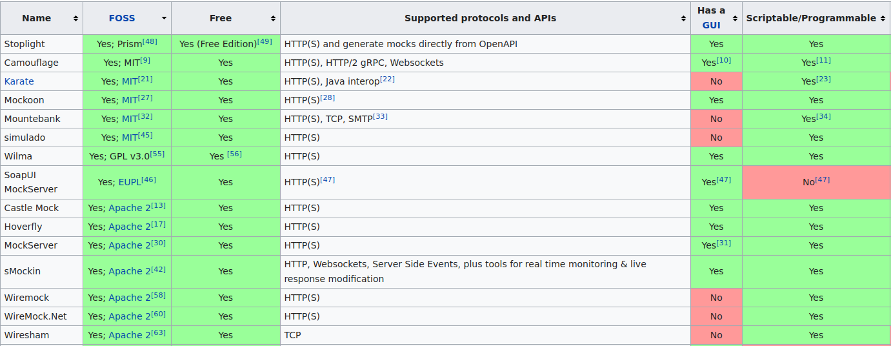

API mocking refers to the process of simulating the behaviour of a real API
using a fake replacement.

There are many great use-cases for API mocking. You may want to mock an API to
eliminate development dependencies between engineering teams. If for example a
service which is a dependency to your front-end isn't ready - you may want a
placeholder which will unblock your front-end team.

API mocking is also a really powerful tool when doing integration tests against
3rd party APIs. This can be broken down roughly into functional and non-function
testing:

- Functional Testing: You care about the semantics of the API. It is important
  to be able to make a request and get an appropriate response which takes your
  request into account. Unfortunately API providers often have sub-par testing
  environments which can make this a real pain.
- Non-Functional Testing: You don't really care about the semantics of the API.
  This can be used to speed up integration tests as requests don't need to
  travel to the API providers servers. You may also want to verify your SLAs,
  load test / stress test your systems etc. In this case being rate-limited by
  the API provider's testmode can be a limiting constraint.

At [Synth](https://getsynth.com), we're building a declarative data generator.
We wanted to apply our data generation engine to mocking a subset of a popular
API and see how far we could go. We set out to prototype a solution over (roughly)
5 days as a side project - this blog post is an overview of that journey.

## Day 1: Picking an API

So much to do, so little time. We decided we wanted to mock a popular API
but didn't know where to start. Companies like Stripe have an
excellent [testmode](https://stripe.com/docs/testing) and even
an [open source http server](https://github.com/stripe/stripe-mock) which you
can use instead.

We decided to ask the internet 'Which API have you been struggling to test
against' on various forums like Reddit, HN and others. Ok so now we wait and see
let's see what the internet has to say.

## Day 2: Choosing Shopify

Lo and behold! the internet responded. A bunch of people responded and primarily
complained about payment processors (except for Stripe which was explicitly
praised yet again!). A few products and companies came up repeatedly as being
difficult to test against. We qualitatively evaluated the internet's feedback
and reviewed documentation from the different APIs mentioned to understand 
the implementation complexity. After all we had 3.5 days left ,so we couldn't 
pick anything too complex. In the end we decided to go with the [Shopify API](https://shopify.dev/api/)!

Just as a disclaimer we have absolutely no issues with Shopify, it just so
happens that a lot of the feedback we got pointed us that direction.

Now the Shopify API is pretty big - and we're building a mock server POC from
scratch, so we decided to narrow down and try to mock a single endpoint
first. We chose
the [Event API](https://shopify.dev/api/admin/rest/reference/events/event)
which seemed pretty straight forward. Looking at the Event API there are three
dimensions to consider when designing our POC solution.

### 1. The Data Model

The Event API returns a JSON payload which is a collection of Events. An example
Event can be seen below:

```json
{
    // Refers to a certain event and its resources.
    "arguments": "Ipod Nano - 8GB",
    // A text field containing information about the event.
    "body": null,
    // The date and time (ISO 8601 format) when the event was created.
    "created_at": "2015-04-20T08:33:57-11:00",
    // The ID of the event.
    "id": 164748010,
    // A human readable description of the event.
    "desciption": "Received a new order",
    // A relative URL to the resource the event is for, if applicable.
    "path": "/admin/orders/406514653/transactions/#1145",
    // A human readable description of the event. Can contain some HTML formatting.
    "message": "Received a new order",
    // The ID of the resource that generated the event.
    "subject_id": 406514653,
    // The type of the resource that generated the event.
    "subject_type": "Order",
    // The type of event that occurred. 
    "verb": "confirmed"
}
```

Off the bat it's clear that there is some business logic that needs to be
implemented. For example, there is some notion of causality, i.e. an `Order`
cannot be `closed` before it's been `placed`. This non-trivial business logic was
good news - it means we can showcase some complex data generation logic that's
built into [synth](https://github.com/getsynth/synth).

Since we don't have access to the code that runs the Shopify API, we have to
simulate the behaviour of the Event data model. There are varying degrees of 
depth into which one can go, and we broke it into 4 levels:

1. Level 1 - **Stub**: Level 1 is just about exposing an endpoint where the data
   on a *per element* basis 'looks' right. You have the correct types, but you
   don't really care about correctness across elements. For example, you care
   that `path` has the correct `subject_id` in the URI, but you don't care that
   a given Order goes from `placed` to `closed` to `re_opened`etc...
2. Level 2 - **Mock**: Level 2 involves maintaining the semantics of the Events
   *collection* as a whole. For example `created_at` should always increase
   as `id` increases
   (a larger `id` means an event was generated at a later date).
   `verb`s should follow proper causality (as per the order example above). etc.
3. Level 3 - **Emulate**: Level 3 is about maintaining semantics *across
   endpoints*. For example creating an order in a different Shopify API endpoint
   should create an `order_placed` event in the Event API.
4. Level 4 - **Simulate**: Here you are basically reverse engineering all the
   business logic of the API. It should be *indistinguishable* from the real
   thing.

Really these levels can be seen as increasing in scope as you simulate
semantics per-element, per-endpoint, cross-endpoint and finally for the entire
API.

### 2. The Endpoint Behaviour

The Event API exposes 2 endpoints:

- `GET /admin/api/2021-07/events.json` which retrieves a list of all events
- `GET /admin/api/2021-07/events/{event_id}.json` which retrieves a single even
  by its ID.

The first endpoint exposes various query parameters (which are basically
filters) which alter the response body:

```
limit:          The number of results to show. (default: 50, maximum: 250)
since_id:       Show only results after the specified ID.
created_at_min: Show events created at or after this date and time. (format: 2014-04-25T16:15:47-04:00)
created_at_max: Show events created at or before this date and time. (format: 2014-04-25T16:15:47-04:00)
filter:         Show events specified in this filter.
verb:           Show events of a certain type.
fields:         Show only certain fields, specified by a comma-separated list of field names.
```

Luckily the filtering behaviour is simple, and as long as the implementation
stays true to the description in the docs it should be easy to emulate.

The second endpoint takes one query parameter which is a comma-separated list of
fields to return for a given event. Again should be easy enough.

### 3. Authentication

We decided not to touch authentication for now as the scope would blow up for a
5-day POC. Interestingly we got a bunch of feedback that mocking OAuth flows or
similar would be *really* useful, regardless of any specific API. We may come 
back to this at a future date.

## Day 3: Evaluating Implementation Alternatives

And then there was Day 3. We'd done our due diligence to pick a popular yet
underserved API, and we'd drilled down on how deep we could go in trying to
faithfully represent the implementation.

As any self-respecting engineer would do, we decided to scour the internet for
off-the-shelf solutions to automate as much of the grunt work as possible. Some
naive Googling brought up a mock server called 
[JSON server](https://github.com/typicode/json-server) - an API
automation solution which spins up a REST API for you given a data definition.
Excited by this we quickly wrote up 2 fake Event API events, and
started JSON server feeding it the fake events - and it worked!

Well almost; we were initially excited by the fact that it did exactly what is
said on the tin and very well, however it didn't have an easy way to specify the
custom query parameters we needed to faithfully reproduce the API. For example
returning results before or after a given `created_at` timestamp (feel free to
let us know if we missed something here!).

So we needed something a little more sophisticated. The internet came to the
rescue again with a comprehensive
[list](https://en.wikipedia.org/wiki/Comparison_of_API_simulation_tools) of API
simulation tools. The basic precondition we had was that the API simulator had
to be OSS with a permissive license we could build on. This immediately
disqualified 50% of the available solutions, and we did a divide and conquer
exercise quickly evaluating the rest.



The remaining tools were either not built for this purpose, or they were
incredibly complex pieces of software that would take a while to get acquainted
with.

In the end we decided to implement the endpoint functionality ourselves - we
figured that a 50 LOC node/express server would do a fine job for a POC.

## Day 4: Implementing the core functionality

Day 4 was the most straight forward. Let's get this thing to work!

### 1. The Data Model

We decided to reproduce the API at level 1-2 since we didn't really have any
other endpoints. We used [synth](https://github.com/getsynth/synth) to quickly
whip up
a [data model](https://github.com/getsynth/model-repository/blob/main/shopify/shopify/events.json.json)
that generates data that looks like responses from the Event API. I won't go 
into depth on
how this works here as it's been covered
in [other posts](2021-08-31-seeding-databases-tutorial.md). In about 15 minutes
we had 10 Mb data that looks like this:

```json
[
    {
        "arguments": "generate virtual platforms",
        "body": null,
        "created_at": "2019-09-17T14:16:47",
        "description": "Received new order",
        "id": 477306,
        "message": "Received new order",
        "path": "/admin/orders/83672/transactions/#6020",
        "subject_id": 1352997,
        "subject_type": "Order",
        "verb": "closed"
    },
    {
        "arguments": "innovate best-of-breed schemas",
        "body": null,
        "created_at": "2017-05-20T00:04:41",
        "description": "Received new order",
        "id": 370051,
        "message": "Received new order",
        "path": "/admin/orders/82607/transactions/#9154",
        "subject_id": 1226112,
        "subject_type": "Order",
        "verb": "sale_pending"
    },
    {
        "arguments": "incentivize scalable mindshare",
        "body": null,
        "created_at": "2018-02-21T12:51:36",
        "description": "Received new order",
        "id": 599084,
        "message": "Received new order",
        "path": "/admin/orders/01984/transactions/#3595",
        "subject_id": 1050540,
        "subject_type": "Order",
        "verb": "placed"
    }
]
```

We then dumped it all in a MongoDB collection with the one-liner:

```bash
$ synth generate shopify --to mongodb://localhost:27017/shopify --size 40000
```

Next step is to re-create the Event API endpoint.

### 2. Creating the API

Creating the API was pretty straightforward. We wrote
a [prisma](https://www.prisma.io/) [model](https://github.com/getsynth/model-repository/blob/main/shopify/prisma/schema.prisma)
for the responses which basically worked out of the box with the data dumped
into MongoDB by `synth`. This gave us all the filtering we needed basically for
free.

Then we wrote a quick and dirty express server that maps the REST endpoint's
querytstrings into a query for prisma. The whole thing turned out to be ~90 LOC.
You can check the
source [here](https://github.com/getsynth/model-repository/blob/main/shopify/src/bin.ts)
.

## Day 5: Packaging


The data is ready, the API is ready, time to package this thing up and give it
to people to actually use. Let's see if our experiment was a success.

While strategising about distributing our API, we were optimising for two 
things:

1. Ease of use - how simple it is for someone to download this thing and get
   going
2. Time - we have 2-3 hours to make sure this thing is packaged and ready to go

in that order.

We needed to pack the data, database and a node runtime to actually run the
server. Our initial idea was to use `docker-compose` with 2 services, the
database and web-server, and then the network plumbing to get it to work. After
discussing this for a few minutes, we decided that `docker-compose` may be an
off-ramp for some users as they don't have it installed or are not familiar 
with how it works. This went against our first tenet which is 'ease of use'.

So we decided to take the slightly harder and hackier route of packaging the
whole thing in a single Docker container. It seemed like the best trade-off
between goals 1 and 2.

There were 6 steps to getting this thing over the line:

1. Start with the MongoDB base image. This gives us a Linux environment and a
   database.
2. Download and install NodeJS runtime in the container.
3. Download and install `synth` in the container.
4. Copy the javascript sources over & the `synth` data model
5. Write a
   small [ENTRYPOINT](https://docs.docker.com/engine/reference/builder/#entrypoint) [shell script](https://github.com/getsynth/model-repository/blob/main/shopify/start.sh)
   to start the `mongod`, server and generate data into the server
6. Start the server and expose port 3000

And we're done! We've ~~hackily~~ happily packaged our mock API in a platform
agnostic one liner.

## Was it a success?

An important aspect of this experiment was to see if we could conceive,
research, design and implement a PoC in a week (as a side project, we were 
working on `synth` at the same time). I can safely say this was a 
success! We got it done to spec. 

An interesting thing to note is that **60%** of the time was spent on 
ideating, researching and planing - and only 40% of the time on the actual
implementation. However, spending all that time planning before writing code 
definitely saved us a bunch of time, and if we didn't plan so much the project would have 
overshot or failed.

Now if the PoC itself was a success is a different question. This is where *you*
come in. If you're using the Event API, build the image and play around with it.

You can get started by quickly cloning
our [git repository](https://github.com/getsynth/model-repository) and then:

```bash
cd shopify && docker build -t shopify-mock . && docker run --rm -p 3000:3000 shopify-mock
```

then simply:

```bash
curl "localhost:3000/admin/api/2021-07/events.json"
```

We'd like to keep iterating on the Shopify API and improve it. If there is
interest we'll add more endpoints and improve the existing Event data model.

If you'd like to contribute, or are interested mocks for other APIs other than 
Shopify, feel free to open an issue on Github!