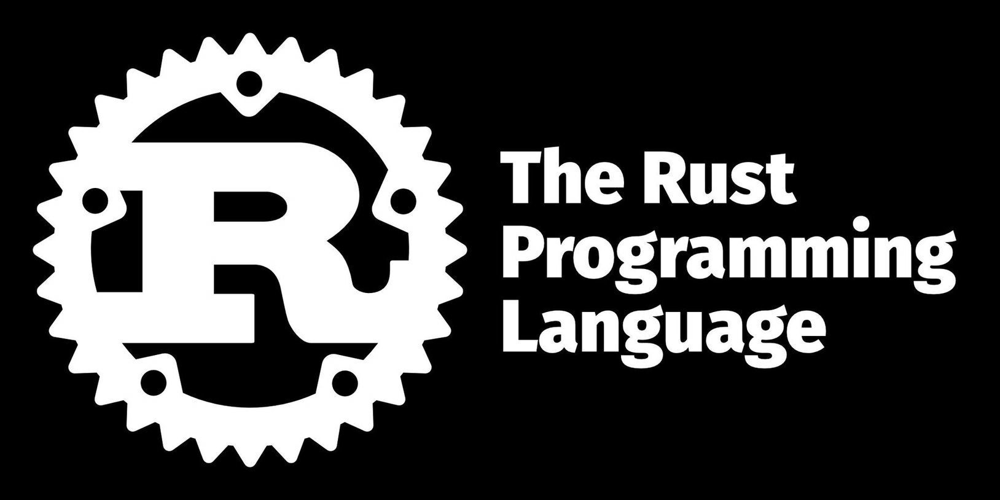

When my colleague Christos [wrote about using Rust for our startup](/docs/blog/2021/10/07/building-a-startup-with-rust), he made no mention of the 
fact that we actually use a nightly Rust compiler, and our code incorporates a set of nightly features. So I thought it might be beneficial to look at the cost-benefit ratio of using Rust nightly, for us, for the open source ecosystem, and for Rust.

*Disclaimer: I wasn't the one who introduced nightly Rust features into this particular codebase, but I have a good few years of experience with nightly Rust, working on [clippy](https://github.com/rust-lang/rust-clippy) since 2015*

## The Good

Everybody loves features! Features are great! Can't have too many of them. And even if you don't use any nightly features, using a nightly Rust compiler will give you 12 weeks of head start on performance benefits before they hit stable Rust. In fact, for a good four years, I only had a nightly compiler installed, because my Chromebook had very little disk space and I needed nightly for clippy anyway. Besides, who's going to find bugs that nightly may have if no one tests it? Apart from officially unstable features (like, say, internal compiler APIs that clippy used), I only ever once encountered any incompatibility – which I will report later.

That said, once you have nightly, those features are a real temptation. Curiosity had me playing with new toys on more than one crate: [bytecount](https://docs.rs/bytecount), initially flamer and overflower, and [mutagen](https://github.com/llogiq/mutagen) is still nightly only. Apart from the latter, most only played with one feature at a time. Even with unstable features, many of them were pretty solid already and changes were often easy enough to follow. And if you only write a prototype of something (well, you probably shouldn't be using Rust, but if like me you are very well versed with it, and feel sufficiently productive), an unstable feature or two may give you the extra oomph to get it done, quickly.

Many of the features unlock certain powers that our code can use (e.g. `async_closure`), or give us a better programming experience (e.g. `box_patterns`). Those latter features are often undervalued; if for example you have a chain of objects on the heap, matching through all of them in one pattern makes the code much easier to read and maintain (as long as that feature is available, of course). Having to write two, three, four `match` statements for this becomes cumbersome quickly.

## The Bad

But there's a psychological factor at play: Once you give in to temptation with one feature, your hesitation to adopting yet another one has already diminished. Adding a third one looks even more benign and the fourth one is a no-brainer, right? And so at synth, our [`core/src/lib.rs`](https://github.com/getsynth/synth/blob/0faba270b07db51231f972e5a0eceb8e3ea54fd3/core/src/lib.rs) starts with this:

```rust
#![feature(
    format_args_capture,
    async_closure,
    map_first_last,
    box_patterns,
    error_iter,
    try_blocks
)]
```

There even used to be a `try_trait` until I removed it because it was easier to replace with a custom implementation than changing the whole code over to `try_trait_v2` when the trait design was improved. The [`synth/src/lib.rs`](https://github.com/getsynth/synth/blob/0faba270b07db51231f972e5a0eceb8e3ea54fd3/synth/src/lib.rs) uses another `concat_idents` feature in some macros, so that's not even all of it. `git blame` tells us that the first four features were introduced in January '21, with the latter two were added in July. Coming back to that `try_trait` change, when [#88223](https://github.com/rust-lang/rust/pull/88223) hit, I found our code no longer compiled with the latest nightly. Of course we had pinned an older nightly, but I regularly checked if there was trouble on the horizon.

Now this trait was mostly used to use `try`-like semantics for [generators](https://github.com/getsynth/synth/blob/0faba270b07db51231f972e5a0eceb8e3ea54fd3/gen/src/generator/mod.rs#L33) (the part of synth that builds the test data) which could either return a result or yield yet another part of the thing to generate. While this design is very elegant, it is not really dependent on the try trait implementation at all, it only reused a few types from it (and even rarely used question marks). So when this code stopped working, I tried to update it to the new implementation, and when that proved too hairy, I simply removed the feature along with the one or two question marks, added our own [`GeneratorResult`](https://github.com/getsynth/synth/blob/0faba270b07db51231f972e5a0eceb8e3ea54fd3/gen/src/generator/try.rs#L12) trait and changed a few occurrences of `Try` trait usage to use our own trait so the code worked again.

I think this case shows us two things:

1. Sometimes the cost-benefit ratio of a feature can change over time, and often the costs are paid later rather than sooner. In this case, it was the cost of replacing the feature with our own implementation which we could have made right away without using the feature. On the other hand, the feature had worked well for us for a good while, so that was basically repaying technical debt.
2. Often, it's not too hard to replace a feature. Still it's a chore that takes up time and resources, so unless there's an acute need to do so, the opportunity cost means other things will often be more valuable right now. So features, once used, tend to linger.

Regarding the pinned nightly and also the only incompatibility I ever encountered, I removed that pin when the May 2021 nightly version we had used stopped working with an updated [`proc_macro2`](https://docs.rs/proc_macro2) crate. It was later re-established with a newer version. We have this version in all our CI jobs and also in our `rust-toolchain` file. There also were a few troubles when we had CI and the main toolchain inadvertently go out of sync, but those were fixed up quickly.

For a version that hails as "unstable", Rust nightly is actually surprisingly solid. That has two reasons: 1. Every PR that gets merged has been extensively tested by CI, so obvious errors get caught out before the code even hits nightly. 2. Whenever a change looks risky, the infrastructure team supplies a "crater run". Crater is a tool that will try to compile *every crate* on crates.io with a given version of a compiler and compares if things fail to compile now. Since crates.io has 68798 crates in stock at the time of this writing, there's a pretty good chance that whatever weird thing you might encounter in live code is thrown at the compiler. I have done such a rustc change once, and it was very reassuring to know that my PR didn't break any code out there.

## The Conclusion

If you want to compile your code with the current fastest version, you can use nightly now. As long as you don't use any features, your code *should* still compile on stable (however, I would still use a stable compiler in CI to check, because some changes may become insta-stable, e.g. added trait implementations; Rust cannot put those behind a feature gate). There is a very small risk of breakage, but you can revert to a beta or stable compiler with no hassle if that happens.

Using nightly *features* is in a way like every other form of technical debt. A bit of risk taking that can give you some potentially big payoff now, at the price of possible future breakage. Whether you want to take that risk depends a lot on your project and the phase it lives in. If you're a startup desperate to get your project out there, not using that feature may mean that there won't be a project to fix later otherwise. On the other hand, if you are writing code that should live for a while, or a library that is aimed to be widely used, avoiding nightly features is likely your best bet.

If you are on nightly, you have two options: Go all in and embrace the instability or pin a known good version. I now think that pinning is the only sane option for all but hobby projects (where a bit of breakage can be acceptable every now and then). I note that clippy has a special place here, because it's essentially tied to the current rust version by design, and we get away with syncing every two weeks and staying on master (not even nightly) otherwise. Once you decide on a pinned version, you may as well pin all your dependencies and update them very cautiously, because any update could break your build. Even then it may be a good idea to test with a current nightly every now and then to gauge whether any incompatibility will hit you whenever you should decide to update.

If you encounter breakage, take a step back and look if the feature is still pulling its weight or if it's cheaper to get rid of it. So to sum up: Going nightly carries some risk. Being aware of and mitigating that risk can give you benefits now, at the cost of a price tag in the future. As always, your mileage may vary.
